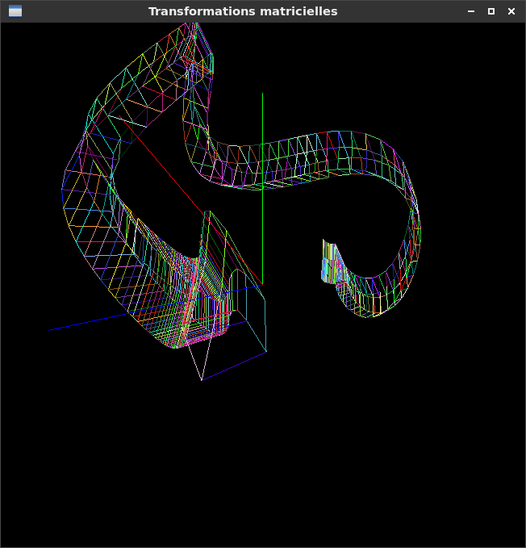

# Manuel d'utilisation du programme

## Résultats

Screenshot de l'application</img>

## Pour compiler et lancer :

make clean

make

./Extrusion

## Utilisation du programme :

cliquer dans la fenetre (chaque clic rajoute un sommet au polygone)

une fois le polygone généré appuyez sur e pour l'extrusion ou r pour la révolution

tourner autour du polygone généré Z,Q,S,D

changement d'affichage, appui successif sur la touche a

* premier mode : filaire

* deuxieme mode : remplissage

* troisieme mode : ombrage (mais mode remplissage lors du display car non implémenté)

re-initialisation : touche i
